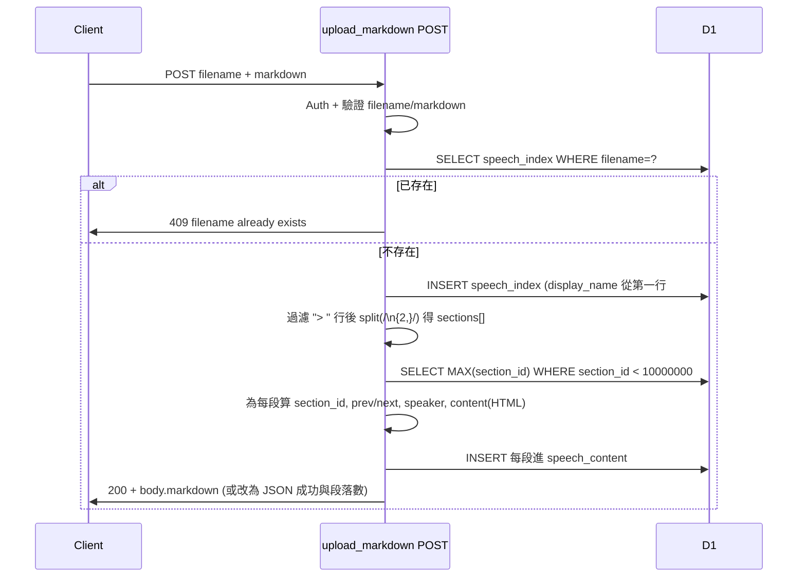

# POST 解析 markdown 並寫入 D1 段落

## 目標

在 [src/api/upload_markdown.ts](src/api/upload_markdown.ts) 的 POST 分支中，在現有「檢查/新增 speech_index」之後：

1. 將 body.markdown 依規則切成多個段落
2. 為每個段落計算 section_id、previous_section_id、next_section_id、section_speaker、section_content
3. 將所有段落 INSERT 進 D1 的 `speech_content` 表

不變：Auth、filename/markdown 驗證、speech_index 存在則 409、不存在則新增一筆再繼續。

---

## 1. 切段落邏輯

- **略過**：以 `>`  開頭的行（整行不參與分段與內容）。
- **分段**：其餘內容以「兩個以上換行」切開，再對每塊做 trim，得到段落陣列。

實作要點：

- 先將 markdown 依 `\n` 拆成行，過濾掉 `line.startsWith('> ')` 的行，再合併回字串。
- 用 `.split(/\n{2,}/).map(s => s.trim()).filter(Boolean)` 得到 `sections[]`（每項為該段落的「原始 markdown」字串）。

---

## 2. section_id 分配（遞減）

- 查詢 D1：`SELECT MAX(section_id) AS max_id FROM speech_content WHERE section_id < 10000000`。
- 若無結果或 `max_id == null`，視為 `0`（或 `999999`，依你現有 ID 範圍決定；若現有資料皆 6 位數以上，可用 `COALESCE(MAX(section_id), 999999)` 再 +1）。
- 第一篇第一個段落：`section_id = max_id + 1`；第二個段落 `max_id`；第三個 `max_id - 1`… 即第 `i` 段（i 從 0 開始）：`section_id = (max_id + 1) - i`。

---

## 3. previous_section_id / next_section_id

- **previous_section_id**：第一段為 `NULL`；其餘為「自己的 section_id + 1」。
- **next_section_id**：最後一段為 `NULL`；其餘為「自己的 section_id - 1」。

與你指定的「第一篇第一個段落 928196 → 928197」一致：文件順序第一段 section_id 最大，往後遞減。

---

## 4. section_speaker（往前看最近一位）

- 在「整份 markdown」中定義「speaker 行」：例如 `### 名稱：` 或 `### 名稱:`（以 `#` 開頭的標題行且行尾有 `：` 或 `:`）。
- 正則範例：`/^#{1,6}\s*(.+?)\s*[:：]\s*$/`，擷取到的為 speaker 名稱（如「唐鳳」）。
- 掃描方式：從檔案開頭往後掃（可先做「去 `>`  行」再掃），每遇到一條 speaker 行就更新「當前 speaker」；每個段落對應到「該段落在全文中的位置」時，取「該段落之前、往前看最近的一條 speaker 行」作為該段的 `section_speaker`。
- 若段落前沒有出現過 speaker 行，`section_speaker` 可為 `NULL` 或空字串（依現有 DB 慣例）。

實作建議：先掃一遍所有行，建出「行號 → 該行是否為 speaker 行、speaker 名稱」；再對每個段落依「段落起始行號」往前找最近一筆 speaker，賦值給該段。

---

## 5. section_content（段落全文含 HTML，但去掉 script）

- 每個段落的內容 = 該段落的「原始 markdown」字串（切段落時已得到）。
- 將該段落的 markdown **轉成 HTML**（需引入 markdown 轉 HTML 的函式庫，見下）。
- 對轉出的 HTML 做一次清理：**移除 `**`（含標籤與內容），其餘標籤保留。
- 寫入 `speech_content.section_content` 的即為上述處理後的 HTML 字串。

現有 [sql/speech/2026-01-29-商周專欄從印度看合作式-ai-主權.sql](sql/speech/2026-01-29-商周專欄從印度看合作式-ai-主權.sql) 中 `section_content` 為 HTML（如 `
...
`），因此需在 API 內做 markdown → HTML。

---

## 6. 依賴：Markdown → HTML

- [package.json](package.json) 目前無 markdown 解析庫，需新增一個可在 Cloudflare Workers 環境執行的套件。
- 建議：`marked` 或 `markdown-it`（純 JS，適合 Workers）。例如：`npm install marked`，在 `upload_markdown.ts` 中對「每個段落的 markdown」呼叫 `marked.parse(sectionMarkdown)` 得到 HTML，再 strip `` 後寫入。

---

## 7. 寫入 speech_content

- 對每個段落一筆：`INSERT INTO speech_content (filename, nest_filename, nest_display_name, section_id, previous_section_id, next_section_id, section_speaker, section_content) VALUES (?, ?, ?, ?, ?, ?, ?, ?)`。
- `filename`：目前 POST 已算好的 `filename`（transform 後）。
- `nest_filename`、`nest_display_name`：此流程為單一演講、非巢狀，填 `NULL`。
- 其餘欄位為上述算出的 `section_id`、`previous_section_id`、`next_section_id`、`section_speaker`、`section_content`。

可依 D1 是否支援 batch 決定用多個 `prepare().bind().run()` 或單一 transaction；若 D1 有 batch API 可一次插入多筆以減少 RTT。

---

## 8. 流程順序（POST 分支）

---

## 9. 回應格式（可選）

- 目前成功時回傳 `c.text(body.markdown, 200, ...)`。若希望讓前端知道已寫入段落數，可改為 `c.json({ success: true, sectionsCount: sections.length, filename }, 200, ...)`，或保留回傳 markdown 並在 header 加 `X-Sections-Count`。此為產品選擇，不影響上述邏輯實作。

---

## 10. 檔案與改動摘要

| 項目                                                       | 說明                                                                                                    |
| -------------------------------------------------------- | ----------------------------------------------------------------------------------------------------- |
| [src/api/upload_markdown.ts](src/api/upload_markdown.ts) | 新增：過濾 `>` 、split 段落、查 MAX(section_id)、speaker 掃描、markdown→HTML、strip script、迴圈 INSERT speech_content。 |
| [package.json](package.json)                             | 新增依賴：`marked`（或 `markdown-it`）。                                                                       |

巢狀演講（nest_filename / nest_display_name）本階段不處理，只寫單一 filename、nest 欄位為 NULL。