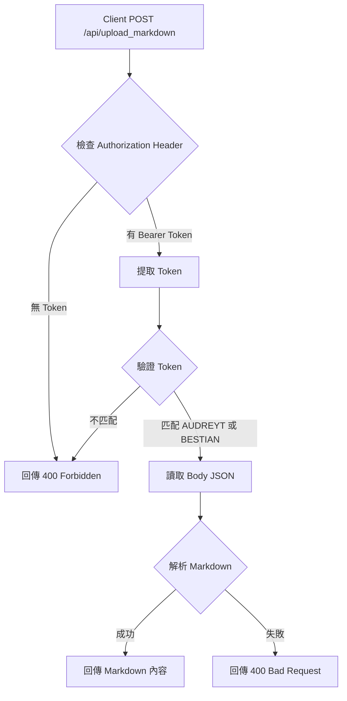

# 建立 upload_markdown 路由和 API

## 概述

在後端新增測試用的 `/upload_markdown` 路由，實作 TOKEN 驗證機制，根據驗證結果回傳 markdown 內容或 400 錯誤。

## 實作細節

### 1. 建立 API 處理器檔案

建立 [`src/api/upload_markdown.ts`](src/api/upload_markdown.ts)：

- 匯入必要的類型：`Context` from 'hono'、`ApiEnv` from './types'、`getCorsHeaders` from './cors'
- 實作 `uploadMarkdown` 函數：
  - 處理 CORS headers
  - 從 `Authorization` header 提取 Bearer token
  - 驗證 token 是否匹配 `AUDREYT_TRANSCRIPT_TOKEN` 或 `BESTIAN_TRANSCRIPT_TOKEN`（任一即可）
  - 從請求 body 的 JSON 格式讀取 markdown 內容（`{ "markdown": "..." }`）
  - 驗證成功：回傳 markdown 原始內容（text/plain 或 JSON 格式）
  - 驗證失敗：回傳 400 Forbidden 錯誤

### 2. 在主路由檔案註冊路由

在 [`src/index.ts`](src/index.ts) 中：

- 匯入 `uploadMarkdown` from './api/upload_markdown'
- 在 API 路由區塊（約第 274-281 行附近）新增：
  ```typescript
  app.post('/api/upload_markdown', (c) => uploadMarkdown(c));
  ```

- 同時處理 CORS preflight（OPTIONS 請求）

## 資料流程



## 錯誤處理

- Token 缺失或格式錯誤：400 Forbidden
- Token 不匹配：400 Forbidden
- Body 格式錯誤：400 Bad Request
- 其他錯誤：500 Internal Server Error（含 CORS headers）

## 注意事項

- 遵循現有 API 的 CORS 處理模式
- 使用與其他 API 相同的錯誤回應格式
- 確保正確處理 JSON body 解析
